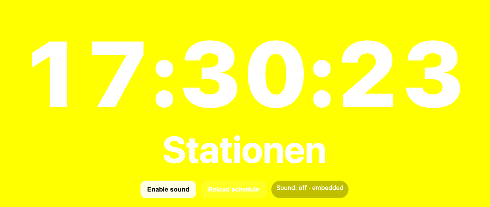

# ⏰ Teach-Timekeep

*A simple, web-based timekeeper for workshops, classrooms, and rehearsals*

**Teach-Timekeep** is a single-file web app (runs on GitHub Pages) that shows a **large digital clock** and follows a **time-based schedule** defined in a CSV file.

At predefined times, it:

* displays a **cue text**
* **blinks** the cue for a few seconds
* optionally plays a **chime**
* changes the **background color** for each time segment

It is designed to be:

* distraction-free
* easy to control from a phone, tablet, or projector
* editable live via **Google Sheets**
* deployable with **zero backend**



---

## ✨ Features

* 🕒 Very large digital clock (HH:MM:SS)
* 📋 Time-based cues loaded from CSV
* 🔁 Automatic daily reset
* 🎯 Blinking cue text when a cue is reached
* 🔔 Optional chime sound (browser-safe)
* 🎨 Background color per time segment
* 🌍 CSV loaded from **public URL** (e.g. Google Sheets)
* 🧠 Fallback to embedded CSV (offline / emergency)
* 🚀 Runs entirely on **GitHub Pages**

---

## 🚀 Live Demo

```
https://YOURNAME.github.io/teach_timekeep/
```

With remote CSV:

```
https://YOURNAME.github.io/teach_timekeep/?csv=YOUR_CSV_URL
```

---

## 🧩 How it works (concept)

1. The page shows the **current local time**
2. A CSV defines **cue times**, **labels**, and **colors**
3. When the clock reaches a cue time:

   * the label appears and blinks
   * a chime is played (if enabled)
4. Between cue times:

   * the background color stays active
   * the label remains visible (not blinking)

---

## 📄 CSV format

Each line in the CSV represents **one cue**.

```csv
HH:MM, "Label text", color
```

### Example

```csv
10:00, "Start", red
10:05, "Rollen", blue
10:10, "Stationen", yellow
```

### Columns

| Column       | Description                       |
| ------------ | --------------------------------- |
| `HH:MM`      | Time (24-hour format, local time) |
| `Label text` | Text shown on screen              |
| `color`      | Any valid CSS color               |

### Color examples

* Named colors: `red`, `blue`, `yellow`
* Hex: `#ffcc00`
* RGB: `rgb(20,120,200)`
* HSL: `hsl(210, 80%, 50%)`

---

## 🌐 Using Google Sheets (recommended)

### Step 1 — Create your sheet

Create a Google Sheet with **three columns**:

| A (Time) | B (Label) | C (Color) |
| -------- | --------- | --------- |
| 10:00    | Start     | red       |
| 10:05    | Rollen    | blue      |
| 10:10    | Stationen | yellow    |

> Quotes around labels are optional in Sheets.

---

### Step 2 — Publish as CSV

1. **File → Share → Publish to web**
2. Select the correct sheet
3. Format: **CSV**
4. Publish

You will get a URL like:

```
https://docs.google.com/spreadsheets/d/e/2PACX-.../pub?gid=0&single=true&output=csv
```

---

### Step 3 — Pass the CSV URL to the app

Append it to the app URL as a query parameter:

```
?csv=YOUR_GOOGLE_CSV_URL
```

#### Full example

```
https://adrianartacho.github.io/teach_timekeep/
?csv=https://docs.google.com/spreadsheets/d/e/2PACX-.../pub?gid=0&single=true&output=csv
```

✔ No CSV stored in the repository
✔ You can edit the schedule live
✔ Reload the page to update timings

> **Note:**
> The app automatically fixes un-encoded Google Sheets URLs, so you do **not** need to URL-encode them.

---

## 🔊 Sound (important browser note)

Due to browser security rules:

* Sound is **disabled by default**
* Click **“Enable sound”** once
* After that, chimes will play automatically

The sound is generated locally using the **Web Audio API**
(no external files required).

---

## 🧪 Offline / fallback mode

If:

* no `?csv=` parameter is provided, or
* the remote CSV cannot be loaded

…the app will use the **embedded CSV** inside `index.html`.

You can edit it directly in the UI and click **Reload schedule**.

This is useful for:

* offline classrooms
* backup scenarios
* testing

---

## 🧠 Timing behaviour (important details)

* Cue triggers once per day per time
* Cue triggers when current time is within the **cue minute**
  (`HH:MM:00` → `HH:MM:59`)
* Blinking duration: **7 seconds**
* Daily reset happens automatically at midnight

---

## 🧩 URL parameters

| Parameter | Description              |
| --------- | ------------------------ |
| `csv`     | Public URL to a CSV file |

Example:

```
?csv=https://example.com/schedule.csv
```

---

## 🛠️ Deployment (GitHub Pages)

1. Create a GitHub repository
2. Add `index.html` (this project)
3. GitHub → **Settings → Pages**
4. Source: `main` branch → `/root`
5. Save

Your app will be live at:

```
https://USERNAME.github.io/REPOSITORY_NAME/
```

---

## 🎓 Typical use cases

* Primary school / Volksschule classroom timing
* Workshops & rotations (“Stationen”)
* Rehearsals
* Performances with fixed cues
* Teacher-controlled time awareness (no phones for kids!)

---

## 🧱 Technical notes

* Single HTML file
* No frameworks
* No backend
* Uses:

  * `fetch()` for CSV
  * `URLSearchParams` for config
  * Web Audio API for chime
* Tested on modern Chrome / Firefox / Safari

---

## 🧭 Roadmap (ideas)

* `?kiosk=1` → hide controls
* `?mute=1`
* Per-cue sounds
* Countdown mode instead of clock
* Multiple parallel timelines

---

## 📜 License

MIT License
Use freely in teaching, workshops, and performances.

---

## 👋 Author

**Adrián Artacho**
Composer · Educator · Researcher
Vienna

---
